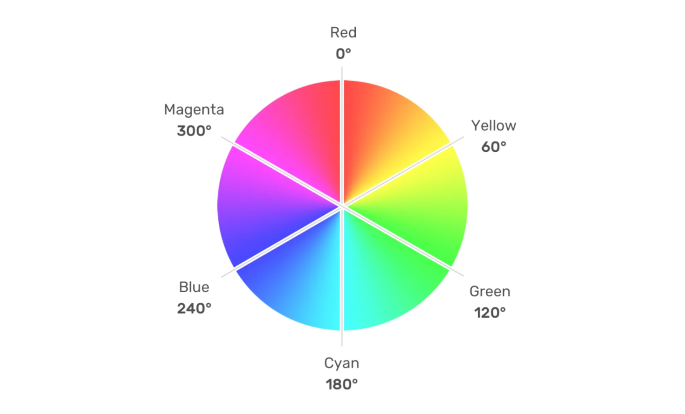

# CSS

## CSS 常见颜色格式

::: tip 案例链接
// todo
:::

> 设置元素的文本或装饰的颜色。
> CSS 基本数据类型 `<color>`

### `Hex`

> 以`“#”`加十六进制

### 十六进制符号：`#RRGGBB[AA]`

R（红）、G（绿）、B （蓝）和 A （alpha）是十六进制字符（0–9、A–F）。A 是可选的。比如，#ff0000 等价于#ff0000ff。

### 十六进制符号：`#RGB[A]`

R（红）、G（绿）、B （蓝）和 A （alpha）是十六进制字符（0–9、A–F）。A 是可选的。三位数符号（#RGB）是六位数形式（#RRGGBB）的减缩版。比如，#f09 和#ff0099 表示同一颜色。类似地，四位数符号（#RGBA）是八位数形式（#RRGGBBAA）的减缩版。比如，#0f38 和#00ff3388 表示相同颜色。

```txt
/* 十六进制语法 */
#f09
#F09
#ff0099
#FF0099


/* 带有 alpha 值的十六进制语法 */
#f09f
#F09F
#ff0099ff
#FF0099FF


```

### `RGB`

颜色可以使用红 - 绿 - 蓝（red-green-blue (RGB)）

> `rgb()` 和 `rgba()` 函数表达式的形式
> 每种颜色使用 0 到 255 之间的数字指定。
> 最常见的 RGB 值黑色：rgb(0,0,0) 和白色：rgb(255,255,255)。

#### `rgb[a](R, G, B[, A])`

R（红）、G（绿）、B （蓝）可以是`<number>`（数字），或者`<percentage>`（百分比），255 相当于 100%。A（alpha）可以是 0 到 1 之间的数字，或者百分比，数字 1 相当于 100%（完全不透明）。

#### `rgb[a](R G B[ / A])`

R（红）、G（绿）、B （蓝）可以是`<number>`（数字），或者`<percentage>`（百分比），255 相当于 100%。A（alpha）可以是 0 到 1 之间的数字，或者百分比，数字 1 相当于 100%（完全不透明）。

**注意：** 不要混用数字和百分比

```txt
/* 函数语法 */
rgb(255,0,153)
rgb(255, 0, 153)
rgb(255, 0, 153.0)
rgb(100%,0%,60%)
rgb(100%, 0%, 60%)
rgb(100%, 0, 60%) /* 错误：不要混用数字和百分比 */
rgb(255 0 153)

/* 带有 alpha 值的函数语法 */
rgb(255, 0, 153, 1)
rgb(255, 0, 153, 100%)

/* 空格语法 */
rgb(255 0 153 / 1)
rgb(255 0 153 / 100%)

/* 带有浮点值的函数语法 */
rgb(255, 0, 153.6, 1)
rgb(1e2, .5e1, .5e0, +.25e2%)

```

### `named-color`

> 关键字，如 blue，transparent

颜色关键字（color keywords）是不区分大小写的标识符，它表示一个具体的颜色，例如 red、blue、brown 或者 lightseagreen 。尽管名称或多或少描述了分别的颜色，但必定是人工的，其后没有严格的标准。

所有预定义颜色名称：https://www.w3schools.com/colors/colors_names.asp

#### transparent

transparent 关键字表示一个完全透明的颜色，即该颜色看上去将是背景色。从技术上说，它是带有阿尔法通道为最小值的黑色，是 rgba(0,0,0,0) 的简写。

#### currentColor 关键字

currentColor 表示当前的颜色。如果没有指定，就会从父容器继承的文本颜色。

currentColor 关键字代表原始的 color 属性的计算值。它允许让继承自属性或子元素的属性颜色属性以默认值不再继承。

它也能用于那些继承了元素的 color 属性计算值的属性，相当于在这些元素上使用 inherit 关键字，如果这些元素有该关键字的话。

该属性在 SVG 中使用时很方便，可以将指定的填充或描边颜色设置为 currentColor，以确保 SVG 颜色与其父级的文本颜色匹配。

### `HSL`

颜色也可以使用 hsl() 函数符被定义为色相 - 饱和度 - 亮度（Hue-saturation-lightness）模式。HSL 相比 RGB 的优点是更加直观：你可以估算你想要的颜色，然后微调。它也更易于创建相称的颜色集合。（通过保持相同的色相并改变亮度/暗度和饱和度）。

> 以 `hsl()` 和 `hsla()` 函数表达式的形式
> 参数形式同 RGB/RGBA

#### 色相 Hue

色相描述了色轮上的值，从 0 到 360 度，从红色开始（0 和 360），参数还可以接角度单位 turn（圈）和无单位



#### 饱和度 Saturation

饱和度是所选色调的鲜艳程度，100% 表示完全饱和的亮色，0% 表示完全不饱和的灰色；


#### 亮度 Lightness

颜色的亮度级别，较低的值会更暗，更接近黑色，较高的值会更亮，更接近白色。


```txt
/* 以下示例都表示同一颜色：a lavender */
hsl(270,60%,70%)
hsl(270, 60%, 70%)
hsl(270 60% 70%)
hsl(270deg, 60%, 70%)
hsl(4.71239rad, 60%, 70%)
hsl(.75turn, 60%, 70%)

/* 以下示例都表示同一颜色：a lavender that is 15% opaque. */
hsl(270, 60%, 50%, .15)
hsl(270, 60%, 50%, 15%)
hsl(270 60% 50% / .15)
hsl(270 60% 50% / 15%)


hsla(240, 100%, 50%, .05)     /*   5% opaque blue */
hsla(240, 100%, 50%, .4)      /*  40% opaque blue */
hsla(240, 100%, 50%, .7)      /*  70% opaque blue */
hsla(240, 100%, 50%, 1)       /* full opaque blue */

/* Whitespace syntax */
hsla(240 100% 50% / .05)      /*   5% opaque blue */

/* Percentage value for alpha */
hsla(240 100% 50% / 5%)       /*   5% opaque blue */

```

### 全局

- `color: inherit;`
- `color: initial;`
- `color: unset;`

## CSS 变量

带有前缀`--`的属性名，比如`--example--name`，表示的是带有值的自定义属性，其可以通过 var 函数在全文档范围内复用的。

CSS 自定义属性是可以级联的：每一个自定义属性可以多次出现，并且变量的值将会借助级联算法和自定义属性值运算出来。

### 基本使用

声明一个自定义属性，属性名需要以两个减号（--）开始，属性值则可以是任何有效的 CSS 值。和其他属性一样，自定义属性也是写在规则集之内的。

```css
.element {
  --main-bg-color: #ccc;
}

:root {
  --main-bg-color: #ccc;
}
```

**备注：**

- 自定义属性名是大小写敏感的，--my-color 和 --My-color 会被认为是两个不同的自定义属性。
- CSS 变量不能是属性名
- 避免循环依赖

### 继承性

自定义属性会继承。这意味着如果在一个给定的元素上，没有为这个自定义属性设置值，在其父元素上的值会被使用。

局部作用域是优先于全局作用域的。

```html
<div class="one">
  <div class="two">
    <div class="three"></div>
    <div class="four"></div>
  </div>
</div>
```

```css
.two {
  --test: 10px;
}

.three {
  --test: 2em;
}
```

在这个情况下， var(--test) 的结果分别是：

- 对于元素 class="two" ：10px
- 对于元素 class="three" ：2em
- 对于元素 class="four" ：10px （继承自父属性）
- 对于元素 class="one" ：非法值，会变成自定义属性的默认值

注意，这些是自定义属性，并不是你在其他编程语言中遇到的实际的变量。这些值仅当需要的时候才会计算，而并不会按其他规则进行保存。比如，你不能为元素设置一个属性，然后让它从兄弟或旁支子孙规则上获取值。属性仅用于匹配当前选择器及其子孙，这和通常的 CSS 是一样的。

### var 函数

用 var() 函数可以定义多个备用值(fallback value)，当给定值未定义时将会用备用值替换。这对于 Custom Elements 和 Shadow DOM 都很有用。

备注： 备用值并不是用于实现浏览器兼容性的。如果浏览器不支持 CSS 自定义属性，备用值也没什么用。它仅对支持 CSS 自定义属性的浏览器提供了一个备份机制，该机制仅当给定值未定义或是无效值的时候生效。

```css
.two {
  width: var(--test, red);
  background-color: var(--my-var, var(--my-background, pink));
}
```

### 有效性和值

传统的 CSS 概念里，有效性和属性是绑定的，这对自定义属性来说并不适用。当自定义属性值被解析，浏览器不知道它们什么时候会被使用，所以必须认为这些值都是有效的。

不幸的是，即便这些值是有效的，但当通过 var() 函数调用时，它在特定上下文环境下也可能不会奏效。属性和自定义变量会导致无效的 CSS 语句，这引入了一个新的概念：计算时有效性。

```css
:root {
  --text-color: 16px;
}
p {
  color: blue;
}
p {
  color: var(--text-color);
}
```

毫不意外，浏览器将 --text-color 的值替换给了 var(--text-color)，但是 16px 并不是 color 的合法属性值。代换之后，该属性不会产生任何作用。浏览器会执行如下两个步骤：

检查属性 color 是否为继承属性。是，但是 `<p>` 没有任何父元素定义了 color 属性。转到下一步。
将该值设置为它的默认初始值，比如 black。

**备注：** 当 CSS 属性 - 值对中存在语法错误，该行则会被忽略。然而如果自定义属性的值无效，它并不会被忽略，从而会导致该值被覆盖为默认值。

对于 CSS 变量的备用值，在替换的过程中，会有四种可能：

- 浏览器不支持 CSS 变量，带有 var()的代码行将会被忽略，将使用浏览器的默认值；
- 浏览器支持变量，并且该变量设置为正确值，则直接使用该变量；
- 浏览器支持变量，并且变量未设置为任何值，则直接使用备用值；
- 浏览器支持变量，并且该变量设置为无效值，则使用浏览器的默认值。

### JavaScript 操作 CSS 变量

```javascript
// 获取一个 Dom 节点上的 CSS 变量
// <p style="--my-var: red"></p>
element.style.getPropertyValue("--my-var");

// 获取任意 Dom 节点上的 CSS 变量
// p { --my-var: red;}
getComputedStyle(element).getPropertyValue("--my-var");

// 修改一个 Dom 节点上的 CSS 变量
element.style.setProperty("--my-var", jsVar + 4);
```

### CSS 变量应用

> 封装一个按钮，通过传入不同的 type，显示不同的颜色。

```html
<button class="btn" data-type="primary">按钮一</button>
<button class="btn" data-type="danger">按钮二</button>
<button class="btn" data-type="success">按钮三</button>
```

```css
:root {
  --btn-primary: #4e7bea;
  --btn-danger: #f31818;
  --btn-success: #43f848;
}

.btn {
  padding: 10px 20px;
  color: black;
}
button.btn.primary {
  background-color: var(--btn-primary);
}
button.btn.danger {
  background-color: var(--btn-danger);
}
button.btn.success {
  background-color: var(--btn-success);
}
```

```javascript
const elements = document.querySelectorAll(".btn");
for (let ele of elements) {
  let type = ele.dataset.type;
  ele.classList.add(type);
}
```

## CSS 函数

### calc

### min

### max

### clamp
