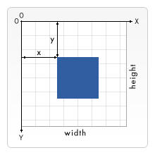

# Canvas

`<canvas>`是一个可以使用脚本 (通常为 JavaScript) 来绘制图形的 HTML 元素。例如，它可以用于绘制图表、制作图片构图或者制作简单的动画。

Canvas 的默认大小为 300 像素 ×150 像素（宽 × 高，像素的单位是 px）。但是，可以使用 HTML 的高度和宽度属性来自定义 Canvas 的尺寸。为了在 Canvas 上绘制图形，我们使用一个 JavaScript 上下文对象，它能动态创建图像。

## 基本用法

`<canvas>` 元素

```html
<canvas id="tutorial" width="150" height="150"></canvas>
```

`<canvas>` 看起来和 `` 元素很相像，唯一的不同就是它并没有 src 和 alt 属性。实际上，`<canvas>` 标签只有两个属性**——** width 和 height。这些都是可选的，并且同样利用 DOM properties 来设置。当没有设置宽度和高度的时候，canvas 会初始化宽度为 300 像素和高度为 150 像素。该元素可以使用 CSS 来定义大小，但在绘制时图像会伸缩以适应它的框架尺寸：如果 CSS 的尺寸与初始画布的比例不一致，它会出现扭曲。

备注： 如果你绘制出来的图像是扭曲的，尝试用 width 和 height 属性为`<canvas>`明确规定宽高，而不是使用 CSS。

在`<canvas>`标签中提供了替换内容。不支持`<canvas>`的浏览器将会忽略容器并在其中渲染后备内容。而支持`<canvas>`的浏览器将会忽略在容器中包含的内容，并且只是正常渲染 canvas。

```html
<canvas id="stockGraph" width="150" height="150"> 替换内容 </canvas>
```

`canvas`元素创造了一个固定大小的画布，它公开了一个或多个**渲染上下文**，其可以用来绘制和处理要展示的内容。

`canvas` 起初是空白的。为了展示，首先脚本需要找到渲染上下文，然后在它的上面绘制。`canvas`元素有一个叫做 `getContext()`的方法，这个方法是用来获得渲染上下文和它的绘画功能。`getContext()`接受一个参数，即上下文的类型。

```javascript
const canvas = document.getElementById("canvas");
const ctx = canvas.getContext("2d");
```

## 绘制图形



canvas 元素默认被网格所覆盖。通常来说网格中的一个单元相当于 canvas 元素中的一像素。栅格的起点为左上角（坐标为（0,0））。所有元素的位置都相对于原点定位。所以图中蓝色方形左上角的坐标为距离左边（X 轴）x 像素，距离上边（Y 轴）y 像素（坐标为（x,y））。

### 图形绘制

`canvas`只支持两种形式的图形绘制：矩形和路径（由一系列点连成的线段）。所有其他类型的图形都是通过一条或者多条路径组合而成的。不过，我们拥有众多路径生成的方法让复杂图形的绘制成为了可能。

首先，我们回到矩形的绘制中。canvas 提供了三种方法绘制矩形：

- `fillRect(x, y, width, height)`

  绘制一个填充的矩形

- `strokeRect(x, y, width, height)`

  绘制一个矩形的边框

- `clearRect(x, y, width, height)`

  清除指定矩形区域，让清除部分完全透明。

上面提供的方法之中每一个都包含了相同的参数。x 与 y 指定了在 canvas 画布上所绘制的矩形的左上角（相对于原点）的坐标。width 和 height 设置矩形的尺寸。

### 路径

图形的基本元素是路径。路径是通过不同颜色和宽度的线段或曲线相连形成的不同形状的点的集合。一个路径，甚至一个子路径，都是闭合的。使用路径绘制图形需要一些额外的步骤。

1. 首先，你需要创建路径起始点。
2. 然后你使用画图命令去画出路径。
3. 之后你把路径封闭。
4. 一旦路径生成，你就能通过描边或填充路径区域来渲染图形。

以下是所要用到的函数：

- `beginPath()`

  新建一条路径，生成之后，图形绘制命令被指向到路径上生成路径。

- `closePath()`

  闭合路径之后图形绘制命令又重新指向到上下文中。

- `stroke()`

  通过线条来绘制图形轮廓。

- `fill()`

  通过填充路径的内容区域生成实心的图形。

生成路径的第一步叫做 beginPath()。本质上，路径是由很多子路径构成，这些子路径都是在一个列表中，所有的子路径（线、弧形、等等）构成图形。而每次这个方法调用之后，列表清空重置，然后我们就可以重新绘制新的图形。

**备注：** 当前路径为空，即调用 beginPath() 之后，或者 canvas 刚建的时候，第一条路径构造命令通常被视为是 moveTo（），无论实际上是什么。出于这个原因，你几乎总是要在设置路径之后专门指定你的起始位置。

第二步就是调用函数指定绘制路径，本文稍后我们就能看到了。

第三，就是闭合路径 closePath(),不是必需的。这个方法会通过绘制一条从当前点到开始点的直线来闭合图形。如果图形是已经闭合了的，即当前点为开始点，该函数什么也不做。

**备注：** 当你调用 fill() 函数时，所有没有闭合的形状都会自动闭合，所以你不需要调用 closePath() 函数。但是调用 stroke() 时不会自动闭合。

### 移动

一个非常有用的函数，而这个函数实际上并不能画出任何东西，也是上面所描述的路径列表的一部分，这个函数就是`moveTo()`。或者你可以想象一下在纸上作业，一支钢笔或者铅笔的笔尖从一个点到另一个点的移动过程。

- `moveTo(x, y)`

  将笔触移动到指定的坐标 x 以及 y 上。

当 canvas 初始化或者`beginPath()`调用后，你通常会使用`moveTo()`函数设置起点。我们也能够使用`moveTo()`绘制一些不连续的路径。

### 线

绘制直线，需要用到的方法`lineTo()`。

- `lineTo(x, y)`

  绘制一条从当前位置到指定 x 以及 y 位置的直线。

该方法有两个参数：x 以及 y，代表坐标系中直线结束的点。开始点和之前的绘制路径有关，之前路径的结束点就是接下来的开始点，等等。。。开始点也可以通过`moveTo()`函数改变。

### 弧

绘制圆弧或者圆，我们使用`arc()`方法。

- `arc(x, y, radius, startAngle, endAngle, anticlockwise)`

  画一个以（x,y）为圆心的以 radius 为半径的圆弧（圆），从 startAngle 开始到 endAngle 结束，按照 anticlockwise 给定的方向（默认为顺时针）来生成。

这里详细介绍一下 arc 方法，该方法有六个参数：`x,y`为绘制圆弧所在圆上的圆心坐标。`radius`为半径。`startAngle`以及`endAngle`参数用弧度定义了开始以及结束的弧度。这些都是以 x 轴为基准。参数`anticlockwise`为一个布尔值。为 true 时，是逆时针方向，否则顺时针方向。

**备注：** `arc()` 函数中表示角的单位是弧度，不是角度。角度与弧度的 js 表达式：

> **弧度=(Math.PI/180)\*角度。**

### 贝塞尔曲线

- `quadraticCurveTo(cp1x, cp1y, x, y)`

  绘制二次贝塞尔曲线，`cp1x,cp1y` 为一个控制点，`x,y` 为结束点。

- `bezierCurveTo(cp1x, cp1y, cp2x, cp2y, x, y)`

  绘制三次贝塞尔曲线，`cp1x,cp1y`为控制点一，`cp2x,cp2y`为控制点二，`x,y`为结束点。


图能够很好的描述两者的关系，二次贝塞尔曲线有一个开始点（蓝色）、一个结束点（蓝色）以及一个控制点（红色），而三次贝塞尔曲线有两个控制点。

参数 x、y 在这两个方法中都是结束点坐标。`cp1x,cp1y`为坐标中的第一个控制点，`cp2x,cp2y`为坐标中的第二个控制点。

### 矩形

直接在画布上绘制矩形也有 rect() 方法，将一个矩形路径增加到当前路径上。

- `rect(x, y, width, height)`

  绘制一个左上角坐标为（x,y），宽高为 width 以及 height 的矩形。

当该方法执行的时候，moveTo() 方法自动设置坐标参数（0,0）。也就是说，当前笔触自动重置回默认坐标。

### path2D

可以使用一系列的路径和绘画命令来把对象“画”在画布上。为了简化代码和提高性能，`Path2D`对象已可以在较新版本的浏览器中使用，用来缓存或记录绘画命令，这样你将能快速地回顾路径。

`Path2D()`会返回一个新初始化的 Path2D 对象（可能将某一个路径作为变量——创建一个它的副本，或者将一个包含 SVG path 数据的字符串作为变量）。

```
new Path2D();     // 空的 Path 对象
new Path2D(path); // 克隆 Path 对象
new Path2D(d);    // 从 SVG 建立 Path 对象
```

所有的路径方法比如`moveTo`, `rect`, `arc`或`quadraticCurveTo`等，如我们前面见过的，都可以在 Path2D 中使用。

Path2D API 添加了 `addPath`作为将`path`结合起来的方法。当你想要从几个元素中来创建对象时，这将会很实用。比如：

- **`Path2D.addPath(path [, transform])`**

​ 添加了一条路径到当前路径（可能添加了一个变换矩阵）。

```javas
function draw() {
  var canvas = document.getElementById('canvas');
  if (canvas.getContext){
    var ctx = canvas.getContext('2d');

    var rectangle = new Path2D();
    rectangle.rect(10, 10, 50, 50);

    var circle = new Path2D();
    circle.moveTo(125, 35);
    circle.arc(100, 35, 25, 0, 2 * Math.PI);

    ctx.stroke(rectangle);
    ctx.fill(circle);
  }
}
```

新的 Path2D API 有另一个强大的特点，就是使用 SVG path data 来初始化 canvas 上的路径。这将使你获取路径时可以以 SVG 或 canvas 的方式来重用它们。

这条路径将先移动到点 `(M10 10)` 然后再水平移动 80 个单位`(h 80)`，然后下移 80 个单位 `(v 80)`，接着左移 80 个单位 `(h -80)`，再回到起点处 (`z`)。

```
var p = new Path2D("M10 10 h 80 v 80 h -80 Z");
```

## 使用样式与颜色

### 色彩 Colors

- `fillStyle = color`

  设置图形的填充颜色。

- `strokeStyle = color`

  设置图形轮廓的颜色。

`color` 可以是表示 CSS 颜色值的字符串，渐变对象或者图案对象。默认情况下，线条和填充颜色都是黑色（CSS 颜色值 `#000000`）。

**备注：** 一旦您设置了 `strokeStyle` 或者 `fillStyle` 的值，那么这个新值就会成为新绘制的图形的默认值。如果你要给每个图形上不同的颜色，你需要重新设置 `fillStyle` 或 `strokeStyle` 的值。

```js
// 这些 fillStyle 的值均为 '橙色'
ctx.fillStyle = "orange";
ctx.fillStyle = "#FFA500";
ctx.fillStyle = "rgb(255,165,0)";
ctx.fillStyle = "rgba(255,165,0,1)";
```

### 透明度 Transparency

除了可以绘制实色图形，我们还可以用 canvas 来绘制半透明的图形。通过设置 `globalAlpha` 属性或者使用一个半透明颜色作为轮廓或填充的样式。

- `globalAlpha = transparencyValue`

  这个属性影响到 canvas 里所有图形的透明度，有效的值范围是 0.0（完全透明）到 1.0（完全不透明），默认是 1.0。

`globalAlpha` 属性在需要绘制大量拥有相同透明度的图形时候相当高效。不过，我认为下面的方法可操作性更强一点。

因为 `strokeStyle` 和 `fillStyle` 属性接受符合 CSS 3 规范的颜色值，那我们可以用下面的写法来设置具有透明度的颜色。

```js
// 指定透明颜色，用于描边和填充样式
ctx.strokeStyle = "rgba(255,0,0,0.5)";
ctx.fillStyle = "rgba(255,0,0,0.5)";
```

`rgba()` 方法与 `rgb()` 方法类似，就多了一个用于设置色彩透明度的参数。它的有效范围是从 0.0（完全透明）到 1.0（完全不透明）。

### 线型 Line styles

可以通过一系列属性来设置线的样式。

- `lineWidth = value`

  设置线条宽度。属性值必须为正数。默认值是 1.0。线宽是指给定路径的中心到两边的粗细。换句话说就是在路径的两边各绘制线宽的一半。因为画布的坐标并不和像素直接对应，当需要获得精确的水平或垂直线的时候要特别注意。

- `lineCap = type`

  设置线条末端样式。可以为下面的三种的其中之一：`butt`，`round` 和 `square`。默认是 `butt`。

- `lineJoin = type`

  设定线条与线条间接合处的样式。它可以是这三种之一：`round`, `bevel` 和 `miter`。默认是 `miter`。

- `miterLimit = value`

  限制当两条线相交时交接处最大长度；所谓交接处长度（斜接长度）是指线条交接处内角顶点到外角顶点的长度。应用 `miter` 的效果，线段的外侧边缘会被延伸交汇于一点上。线段之间夹角比较大时，交点不会太远，但随着夹角变小，交点距离会呈指数级增大。

  `miterLimit` 属性就是用来设定外延交点与连接点的最大距离，如果交点距离大于此值，连接效果会变成了 bevel。注意，最大斜接长度（即交点距离）是当前坐标系测量线宽与此`miterLimit`属性值（HTML canvas 默认为 10.0）的乘积，所以`miterLimit`可以单独设置，不受显示比例改变或任何仿射变换的影响：它只影响线条边缘的有效绘制形状。

  更准确的说，斜接限定值（`miterLimit`）是延伸长度（在 HTML Canvas 中，这个值是线段外连接点与路径中指定的点之间的距离）与一半线宽的最大允许比值。它也可以被等效定义为线条内外连接点距离（`miterLength`）与线宽（`lineWidth`）的最大允许比值（因为路径点是内外连接点的中点）。这等同于相交线段最小内夹角（_θ_）的一半的余割值，小于此角度的斜接将不会被渲染，而仅渲染斜边连接：

  - `miterLimit` = **max** `miterLength` / `lineWidth` = 1 / **sin** ( **min** _θ_ / 2 )
  - 斜接限定值默认为 10.0，这将会去除所有小于大约 11 度的斜接。
  - 斜接限定值为 √2 ≈ 1.4142136（四舍五入）时，将去除所有锐角的斜接，仅保留钝角或直角。
  - 1.0 是合法的斜接限定值，但这会去除所有斜接。
  - 小于 1.0 的值不是合法的斜接限定值。

- `getLineDash()`

  返回一个包含当前虚线样式，长度为非负偶数的数组。

  用 `setLineDash` 方法和 `lineDashOffset` 属性来制定虚线样式。`setLineDash` 方法接受一个数组，来指定线段与间隙的交替；`lineDashOffset` 属性设置起始偏移量。

- `setLineDash(segments)`

  设置当前虚线样式。

- `lineDashOffset = value`

  设置虚线样式的起始偏移量。

### 渐变 Gradients

可以用线性或者径向的渐变来填充或描边。我们用下面的方法新建一个 `canvasGradient` 对象，并且赋给图形的 `fillStyle` 或 `strokeStyle` 属性。

- `createLinearGradient(x1, y1, x2, y2)`

  createLinearGradient 方法接受 4 个参数，表示渐变的起点 (x1,y1) 与终点 (x2,y2)。

- `createRadialGradient(x1, y1, r1, x2, y2, r2)`

  createRadialGradient 方法接受 6 个参数，前三个定义一个以 (x1,y1) 为原点，半径为 r1 的圆，后三个参数则定义另一个以 (x2,y2) 为原点，半径为 r2 的圆。

```
var lineargradient = ctx.createLinearGradient(0,0,150,150);
var radialgradient = ctx.createRadialGradient(75,75,0,75,75,100);
```

创建出 `canvasGradient` 对象后，我们就可以用 `addColorStop` 方法给它上色了。

- `gradient.addColorStop(position, color)`

  addColorStop 方法接受 2 个参数，`position` 参数必须是一个 0.0 与 1.0 之间的数值，表示渐变中颜色所在的相对位置。例如，0.5 表示颜色会出现在正中间。`color` 参数必须是一个有效的 CSS 颜色值（如 #FFF，rgba(0,0,0,1)，等等）。

你可以根据需要添加任意多个色标（color stops）。下面是最简单的线性黑白渐变的例子。

```
var lineargradient = ctx.createLinearGradient(0,0,150,150);
lineargradient.addColorStop(0,'white');
lineargradient.addColorStop(1,'black');
```

### 图案样式 Patterns

- `createPattern(image, type)`

  该方法接受两个参数。Image 可以是一个 `Image` 对象的引用，或者另一个 canvas 对象。`Type` 必须是下面的字符串值之一：`repeat`，`repeat-x`，`repeat-y` 和 `no-repeat`。

**备注：** 用 canvas 对象作为 `Image` 参数在 Firefox 1.5 (Gecko 1.8) 中是无效的。

图案的应用跟渐变很类似的，创建出一个 pattern 之后，赋给 `fillStyle` 或 `strokeStyle` 属性即可。

```
var img = new Image();
img.src = 'someimage.png';
var ptrn = ctx.createPattern(img,'repeat');
```

**备注：** 与 drawImage 有点不同，你需要确认 image 对象已经装载完毕，否则图案可能效果不对的。

### 阴影 Shadows

- `shadowOffsetX = float`

  `shadowOffsetX` 和 `shadowOffsetY` 用来设定阴影在 X 和 Y 轴的延伸距离，它们是不受变换矩阵所影响的。负值表示阴影会往上或左延伸，正值则表示会往下或右延伸，它们默认都为 `0`。

- `shadowOffsetY = float`

  shadowOffsetX 和 `shadowOffsetY` 用来设定阴影在 X 和 Y 轴的延伸距离，它们是不受变换矩阵所影响的。负值表示阴影会往上或左延伸，正值则表示会往下或右延伸，它们默认都为 `0`。

- `shadowBlur = float`

  shadowBlur 用于设定阴影的模糊程度，其数值并不跟像素数量挂钩，也不受变换矩阵的影响，默认为 `0`。

- `shadowColor = color`

  shadowColor 是标准的 CSS 颜色值，用于设定阴影颜色效果，默认是全透明的黑色。

### Canvas 填充规则

当我们用到 `fill`（或者 `clip` 和 `isPointinPath`）你可以选择一个填充规则，该填充规则根据某处在路径的外面或者里面来决定该处是否被填充，这对于自己与自己路径相交或者路径被嵌套的时候是有用的。

两个可能的值：

- **`"nonzero`**": [non-zero winding rule](http://en.wikipedia.org/wiki/Nonzero-rule), 默认值。
- **`"evenodd"`**: [even-odd winding rule](http://en.wikipedia.org/wiki/Even–odd_rule).

## 绘制文本

canvas 提供了两种方法来渲染文本：

- `fillText(text, x, y [, maxWidth])`

  在指定的 (x,y) 位置填充指定的文本，绘制的最大宽度是可选的。

- `strokeText(text, x, y [, maxWidth])`

  在指定的 (x,y) 位置绘制文本边框，绘制的最大宽度是可选的。

```js
function draw() {
  var ctx = document.getElementById("canvas").getContext("2d");
  ctx.font = "48px serif";
  ctx.fillText("Hello world", 10, 50);
}

function draw() {
  var ctx = document.getElementById("canvas").getContext("2d");
  ctx.font = "48px serif";
  ctx.strokeText("Hello world", 10, 50);
}
```

### 有样式的文本

在上面的例子用我们已经使用了 `font` 来使文本比默认尺寸大一些。还有更多的属性可以让你改变 canvas 显示文本的方式：

- `font = value`

  当前我们用来绘制文本的样式。这个字符串使用和 [CSS](https://developer.mozilla.org/zh-CN/docs/Web/CSS) [`font`](https://developer.mozilla.org/zh-CN/docs/Web/CSS/font) 属性相同的语法。默认的字体是 `10px sans-serif`。

- `textAlign = value`

  文本对齐选项。可选的值包括：`start`, `end`, `left`, `right` or `center`. 默认值是 `start`。

- `textBaseline = value`

  基线对齐选项。可选的值包括：`top`, `hanging`, `middle`, `alphabetic`, `ideographic`, `bottom`。默认值是 `alphabetic`。

- `direction = value`

  文本方向。可能的值包括：`ltr`, `rtl`, `inherit`。默认值是 `inherit`。

当你需要获得更多的文本细节时，下面的方法可以给你测量文本的方法。

- `measureText()`

  将返回一个 `TextMetrics`对象的宽度、所在像素，这些体现文本特性的属性。

```js
function draw() {
  var ctx = document.getElementById("canvas").getContext("2d");
  var text = ctx.measureText("foo"); // TextMetrics object
  text.width; // 16;
}
```

- [使用图像](https://developer.mozilla.org/zh-CN/docs/Web/API/Canvas_API/Tutorial/Using_images)
- [变形](https://developer.mozilla.org/zh-CN/docs/Web/API/Canvas_API/Tutorial/Transformations)
- [合成和剪辑](https://developer.mozilla.org/zh-CN/docs/Web/API/Canvas_API/Tutorial/Compositing)
- [基本动画](https://developer.mozilla.org/zh-CN/docs/Web/API/Canvas_API/Tutorial/Basic_animations)
- [高级动画](https://developer.mozilla.org/zh-CN/docs/Web/API/Canvas_API/Tutorial/Advanced_animations)
- [像素处理](https://developer.mozilla.org/zh-CN/docs/Web/API/Canvas_API/Tutorial/Pixel_manipulation_with_canvas)
- [点击区域和无障碍访问](https://developer.mozilla.org/zh-CN/docs/Web/API/Canvas_API/Tutorial/Hit_regions_and_accessibility)
- [优化 canvas](https://developer.mozilla.org/zh-CN/docs/Web/API/Canvas_API/Tutorial/Optimizing_canvas)
- [终曲](https://developer.mozilla.org/zh-CN/docs/Web/API/Canvas_API/Tutorial/Finale)
