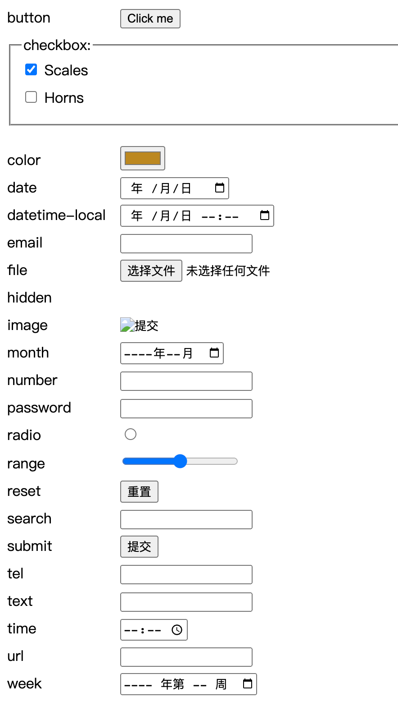

# Input types

```html
<input type="button" />
<input type="checkbox" />
<input type="color" />
<input type="date" />
<input type="datetime-local" />
<input type="email" />
<input type="file" />
<input type="hidden" />
<input type="image" />
<input type="month" />
<input type="number" />
<input type="password" />
<input type="radio" />
<input type="range" />
<input type="reset" />
<input type="search" />
<input type="submit" />
<input type="tel" />
<input type="text" />
<input type="time" />
<input type="url" />
<input type="week" />
```



## button

元素 `<input type="button">` 是 `<input>` 元素的特殊版本，被用来创建一个没有默认值的可点击按钮。它已经在 HTML5 被 `<button>` 元素取代

浏览器生成一个控件没有默认值的可点击按钮。该按钮上可有任何标签。该控件在不同的浏览器上，可能有不同的样式。

## checkbox

checkbox 类型的 `<input>` 元素在默认情况下被呈现为激活时被选中（打勾）的方框，就像你在官方的政府文件表格中看到的那样。具体外观取决于浏览器运行的操作系统配置。一般来说，这是一个正方形，但它可能有圆角。复选框允许你在表格中选择单一的数值进行提交（或不提交）。

## color

color 类型的 `<input>` 元素为用户提供了指定颜色的用户界面，或使用可视化颜色选择器，或以 #rrggbb 十六进制格式输入颜色值。

虽然 CSS 颜色有很多格式（如颜色名称、功能表记和含有透明通道的十六进制），但是这里只支持简单颜色（无透明通道）。

此元素的外观会因浏览器不同而不同，它可能是一个简单的文本输入，自动验证以确保颜色信息以正确的格式输入，或一个平台标准的颜色选择器，或某种自定义的颜色选择器窗口。

## date

type="date" 类型的 `<input>` 元素会创建一个让用户输入一个日期的输入区域，可以使用自动验证内容的文本框，也可以使用特殊的日期选择器界面。结果值包括年份，月份和日期，但不包括时间。time 和 datetime-local 类型支持时间和日期时间输入。

## datetime-local

`<input>` 元素的 datetime-local 类型创建让用户便捷输入日期和时间的输入控件，包括“年”、“月”、“日”，以及“时”和“分”。

## email

带有 "email" (电子邮箱) 类型标记的输入框元素 (`<input>`) 能够让用户输入或编辑一个电子邮箱地址，此外，如果指定了 multiple 属性，用户还可以输入多个电子邮箱地址。在表单提交前，输入框会自动验证输入值是否是一个或多个合法的电子邮箱地址 (非空值且符合电子邮箱地址格式). CSS 伪标签 :valid 和 :invalid 能够在校验后自动应用。

## file

带有 type="file" 的 `<input>` 元素允许用户可以从他们的设备中选择一个或多个文件。选择后，这些文件可以使用提交表单的方式上传到服务器上，或者通过 Javascript 代码和文件 API 对文件进行操作。

## hidden

hidden 类型的 `<input>` 元素允许 Web 开发者包含用户不可见、不可改的数据，在用户提交表单时，这些数据会一并发送出。比如，正被请求或编辑的内容的 ID，或是一个唯一的安全令牌。这些隐藏的 input 元素在渲染完成的页面中完全不可见，而且没有方法可以使它重新变为可见。

## image

`<input type="image">` 标签是一个图片提交按钮。你必须使用 src 属性来定义图片的源，并且使用 alt 来定义当图片无法显示的时候的替代文字。 height 和 width 属性是用来定义图片的高和宽的。

## month

类型为 month 的 `<input>` 可以让你容易地创建一个方便输入年份或月份的一个 `<input>`。输入的值是一个经过“YYYY-MM”格式化的字符串，其中 YYYY 是四位数的年份，而 MM 是月份的数值表示。

## number

number 类型的 `<input>` 元素用于让用户输入一个数字，其包括内置验证以拒绝非数字输入。浏览器可能会选择提供步进箭头，让用户可以使用鼠标增加和减少输入的值，或者只需用指尖敲击即可。

## password

`<input>` 元素 里有一种叫做 "password" 的值，给我们一个方法让用户更加安全的输入密码。这个元素是作为一行纯文本编辑器控件呈现的，其中文本被遮蔽以致于无法读取，通常通过用诸如星号（“\*”）或点（“•”）等符号替换每个字符来实现。）这个符号会根据用户的浏览器和操作系统来具体显示哪个。

## radio

`<input>` 的 radio 类型元素默认渲染为小型圆圈图表，填充即为激活，类似于之前描述额复选框（checkbox）类型。单选按钮允许你选择单一的值来提交表单。

## range

range 类型的 `<input>` 元素允许用户指定一个数值，该数值必须不小于给定值，并且不得大于另一个给定值。但是，其精确值并不重要。通常使用滑块或拨号控件而不是像 number 输入类型这样的文本输入框来表示。
由于这种小部件不精确，因此除非控件的确切值不重要，否则通常不应使用它。

## reset

reset 类型的 `<input>` 元素将渲染为按钮，且带有默认的 click 事件，用于将表单中的所有输入重置为其初始值。

## search

`<input>` 元素的 search 类型是 专为用户输入搜索查询而设计的文本字段。功能上与 text 输入相同，但是可以通过 user agent 进行不同样式的设置。

## submit

submit 类型的 `<input>` 元素会渲染为按钮。当 click 事件发生时（用户点击按钮是一个典型的点击事件）， 用户代理 尝试提交表单到服务器。

## tel

tel 类型的 `<input>` 元素用于让用户输入和编辑电话号码。不同于 `<input type="email">` 和 `<input type="url">`，在提交表单之前，输入值不会被自动验证为特定格式，因为世界各地的电话号码格式差别很大。

## text

text 类型的 `<input>` 元素创建了基础的单行文本字段。

## time

类型为 time 的 `<input>` 元素，旨在让用户轻松输入时间（小时和分钟，以及可选的秒）。
控件的用户界面因浏览器而异，请查阅浏览器兼容性以了解更多细节。在不支持该类型的浏览器中，它会优雅地降级为 `<input type="text">`。

## url

url 类型的 `<input>` 元素用来让用户输入和编辑 URL。
所输入的值在表单提交前会自动经过验证，以确认它为空，或为一个合法的 URL 格式。:valid 和 :invalid CSS 伪类会适当地自动应用，以在视觉上表示当前值是否为一个合法的 URL 值。
对于不支持类型为 url 的输入框的浏览器，它会回退为标准的 text 输入框

## week

`<input>` 类型为 week 的元素会创建输入字段，以便轻松输入年份以及该年（即第 1 周到第 52 或 53 周）的 ISO 8601 星期数
