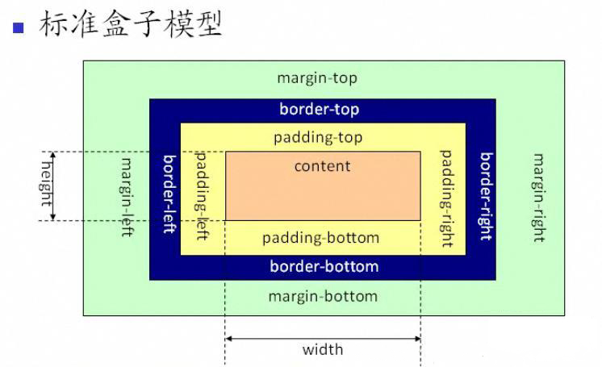

# BFC

## 2、CSS 盒模型

CSS3 中的盒模型有以下两种：标准盒子模型、IE 盒子模型

盒模型都是由四个部分组成的,分别是 margin、border、padding 和 content.




标准盒模型和 IE 盒模型的区别在于设置 width 和 height 时,所对应的范围不同:

- 标准盒模型的 width 和 height 属性的范围只包含了 content,
- IE 盒模型的 width 和 height 属性的范围包含了 border、padding 和 content.

可以通过修改元素的 box-sizing 属性来改变元素的盒模型:

- box-sizing: content-box 表示标准盒模型（默认值）， `content-box` 是默认值。如果你设置一个元素的宽为 100px，那么这个元素的内容区会有 100px 宽，并且任何边框和内边距的宽度都会被增加到最后绘制出来的元素宽度中。
- box-sizing: border-box 表示 IE 盒模型（怪异盒模型），设置的边框和内边距的值是包含在 width 内的。也就是说，如果你将一个元素的 width 设为 100px，那么这 100px 会包含它的 border 和 padding，内容区的实际宽度是 width 减去(border + padding)的值。大多数情况下，这使得我们更容易地设定一个元素的宽高。

## margin 重叠问题

**问题描述:** 两个块级元素的上外边距和下外边距可能会合并（折叠）为一个外边距,其大小会取其中外边距值大的那个,这种行为就是外边距折叠.需要注意的是,**浮动的元素和绝对定位**这种脱离文档流的元素的外边距不会折叠.重叠只会出现在**垂直方向**.

下面代码效果: box1 和 box2 都有上边距 100px,相对位置没有变化.和预期效果（子元素 div.box2 会从左上角移动到父元素 div.box1
的左下角,父元素位置不变）不同。

```html
<style>
  .box1 {
    width: 200px;
    height: 200px;
    background-color: saddlebrown;
  }

  .box2 {
    width: 100px;
    height: 100px;
    background-color: sandybrown;
    margin-top: 100px;
  }
</style>

<body>
  <div class="box1">
    <div class="box2"></div>
  </div>
</body>
```

**计算原则:**

折叠合并后外边距的计算原则如下:

- 如果两者都是正数,那么就去最大者
- 如果是一正一负,就会正值减去负值的绝对值
- 两个都是负值时,用 0 减去两个中绝对值大的那个

**解决办法:**

对于折叠的情况,主要有两种:**兄弟之间重叠**和**父子之间重叠**

（1）兄弟之间重叠

- 底部元素变为行内盒子:`display: inline-block`
- 底部元素设置浮动:`float`
- 底部元素的 position 的值为`absolute/fixed`

（2）父子之间重叠

- 父元素加入:`overflow: hidden`
- 父元素添加透明边框:`border:1px solid transparent`
- 子元素变为行内盒子:`display: inline-block`
- 子元素加入浮动属性或定位

## 高度塌缩

在浮动布局中,父元素默认是被子元素撑开的,当子元素浮动后,其会完全脱离文档流,子元素从文档流中脱离,将会无法撑起父元素的高度,导致父元素的高度丢失,父元素高度丢失后,其下的元素会自动上移,导致页面布局混乱,所以高度塌陷是比较常见的问题.

**解决办法:**

1. BFC

BFC（Block Formatting Context）块级格式化环境。BFC 是 CSS 中的一个隐藏属性,可以为一个元素开启 BFC;开启 BFC 该元素就是一个独立布局区域 元素开启 BFC 后的特点:

- 开启 BFC 的元素不会被浮动元素覆盖
- 开启 BFC 的元素子元素和父元素的外边距不会重叠
- 开启 BFC 的元素可以包含浮动的元素

需要通过一些特殊方式开启元素 BFC:

- 设置元素的浮动 （不推荐）. `float: left;`
- 将元素设置为行内块元素 （不推荐）. `display: inline-block;`
- 将元素 overflow 设置为一个非 visible 的值,常见方式为元素设置 overflow:hidden 开启其
  BFC,以使其可以包含浮动的元素. `overflow: auto;`

第一种方式设置父元素浮动使父元素也脱离了文档流;第二种一般不采用设置行内块元素的方式;第三种可以使父元素保持块元素特点,同时宽高由子元素撑开.

1. 使用 clear 解决

设置清除浮动以后,浏览器会自动为元素添加一个上外边距以使其位置不受其他元素影响
添加 `clear: both;` 清除浮动元素对当前元素所产生的影响

1. 通过 HTML 的方式来影响 CSS 样式

可以通过设置一个 div（与浮动元素同一级）,给他设置`clear:both`来撑开父元素的空间,这样父元素的空间就会随着子元素宽高的变化而变化,不受浮动影响;

4. 最终解决方案

css 样式里在 box 的后面用 content 添加一个空元素,并设置为块元素,clear:both.

在父级元素添加 class=“clearfix”,样式如下:

```css
.clearfix::before,
.clearfix::after {
  content: "";
  display: table;
  clear: both;
}
```

## BFC 块级格式化上下文

https://juejin.cn/post/6844904169875177479

BFC 是一个独立的区域,它内部的元素都依照它的规则渲染,并且不会与 BFC 外部打交道.

**以下方式会创建 BFC:**

- 根元素或包含根元素的元素
- 浮动元素（元素的 float 不是 none）
- 绝对定位元素（元素的 position 为 absolute 或 fixed）
- 行内块元素（元素的 display 为 inline-block）
- 表格单元格（元素的 display 为 table-cell,HTML 表格单元格默认为该值）
- 表格标题（元素的 display 为 table-caption,HTML 表格标题默认为该值）
- 匿名表格单元格元素（元素的 display 为 table、table-row、 table-row-group、table-header-group、table-footer-group（分别是
  HTML
  table、row、tbody、thead、tfoot 的默认属性）或 inline-table）
- overflow 值不为 visible 的块元素
- display 值为 flow-root 的元素
- contain 值为 layout、content 或 strict 的元素
- 弹性元素（display 为 flex 或 inline-flex 元素的直接子元素）
- 网格元素（display 为 grid 或 inline-grid 元素的直接子元素）
- 多列容器（元素的 column-count 或 column-width 不为 auto,包括 column-count 为 1）
- column-span 为 all 的元素始终会创建一个新的 BFC,即使该元素没有包裹在一个多列容器中

当一个元素设置了新的 BFC 后,就和这个元素外部的 BFC 没有关系了,这个元素只会去约束自己内部的子元素.

**BFC 的布局规则例如以下:**

- 内部的盒子会在垂直方向,一个个地放置;
- 盒子垂直方向的距离由 margin 决定,属于同一个 BFC 的两个相邻 Box 的上下 margin 会发生重叠;
- 每一个元素的左边,与包含块的左边相接触（对于从右往左的布局,则相反）,即使存在浮动也是如此;
- BFC 的区域不会与 float 重叠;
- BFC 就是页面上的一个隔离的独立容器,容器里面的子元素不会影响到外面的元素.反之也如此;
- 计算 BFC 的高度时,浮动元素也參与计算.

**应用场景**

**1.防止浮动元素高度塌陷**

不适用 BFC 情况下，子元素使用浮动，父元素高度会塌陷

**2.避免外边距折叠**

当 2 个 box 在同一个 BFC 容器内，同时使用 margin 会引起外边距重合

**3.自适应两栏布局**

根据规则 BFC 的区域不会与浮动元素的 box 重叠，可以实现自适应两栏布局

## 层叠上下文

我们假定用户正面向（浏览器）视窗或网页，而 HTML 元素沿着其相对于用户的一条虚构的 z 轴排开，**层叠上下文**就是对这些 HTML 元素的一个三维构想。众 HTML 元素基于其元素属性按照优先级顺序占据这个空间。

层叠上下文

在本篇之前的部分——运用 z-index，（我们认识到）某些元素的渲染顺序是由其 `z-index` 的值影响的。这是因为这些元素具有能够使他们形成一个*层叠上下文*的特殊属性。

文档中的层叠上下文由满足以下任意一个条件的元素形成：

- 文档根元素（`<html>`）；
- `position` 值为 `absolute`（绝对定位）或 `relative`（相对定位）且 `z-index` 值不为 `auto` 的元素；
- `position` 值为 `fixed`（固定定位）或 `sticky`（粘滞定位）的元素（沾滞定位适配所有移动设备上的浏览器，但老的桌面浏览器不支持）；
- flex 容器的子元素，且 `z-index` 值不为 `auto`；
- grid 容器的子元素，且 `z-index` 值不为 `auto`；
- `opacity`属性值小于 `1` 的元素；
- `mix-blend-mode`属性值不为 `normal` 的元素；
- 以下任意属性值不为 `none` 的元素：
  - `transform`
  - `filter`
  - `backdrop-filter`
  - `perspective`
  - `clip-path`
  - `mask`/`mask-image`/`mask-border`
- `isolation`属性值为 `isolate` 的元素；
- `will-change` 值设定了任一属性而该属性在 non-initial 值时会创建层叠上下文的元素；
- `contain`属性值为 `layout`、`paint` 或包含它们其中之一的合成值（比如 `contain: strict`、`contain: content`）的元素。

在层叠上下文中，子元素同样也按照上面解释的规则进行层叠。重要的是，其子级层叠上下文的 `z-index` 值只在父级中才有意义。子级层叠上下文被自动视为父级层叠上下文的一个独立单元。

总结：

- 层叠上下文可以包含在其他层叠上下文中，并且一起创建一个层叠上下文的层级。
- 每个层叠上下文都完全独立于它的兄弟元素：当处理层叠时只考虑子元素。
- 每个层叠上下文都是自包含的：当一个元素的内容发生层叠后，该元素将被作为整体在父级层叠上下文中按顺序进行层叠。

**备注：** 层叠上下文的层级是 HTML 元素层级的一个子级，因为只有某些元素才会创建层叠上下文。可以这样说，没有创建自己的层叠上下文的元素会被父层叠上下文*同化*。

例子代码，添加解释

## 块格式化上下文

**块格式化上下文**（Block Formatting Context，BFC）是 Web 页面的可视 CSS 渲染的一部分，是块级盒子的布局过程发生的区域，也是浮动元素与其他元素交互的区域。

下列方式会创建块格式化上下文：

- 根元素（`<html>`）
- 浮动元素（`float` 值不为 `none`）
- 绝对定位元素（`position` 值为 `absolute` 或 `fixed`）
- 行内块元素（`display` 值为 `inline-block`）
- 表格单元格（`display` 值为 `table-cell`，HTML 表格单元格默认值）
- 表格标题（`display` 值为 `table-caption`，HTML 表格标题默认值）
- 匿名表格单元格元素（`display` 值为 `table`、`table-row`、`table-row-group`、`table-header-group`、`table-footer-group`（分别是 HTML table、tr、tbody、thead、tfoot 的默认值）或 `inline-table`）
- `overflow` 值不为 `visible`、`clip` 的块元素
- `display` 值为 `flow-root` 的元素
- `contain` 值为 `layout`、`content` 或 `paint` 的元素
- 弹性元素（`display` 值为 `flex` 或 `inline-flex` 元素的直接子元素），如果它们本身既不是 flex、grid 也不是 table 容器
- 网格元素（`display` 值为 `grid` 或 `inline-grid` 元素的直接子元素），如果它们本身既不是 flex、grid 也不是 table 容器
- 多列容器（`column-count`或 `column-width`值不为 `auto`，包括`column-count` 为 `1`）
- `column-span` 值为 `all` 的元素始终会创建一个新的 BFC，即使该元素没有包裹在一个多列容器中。

格式化上下文影响布局，通常，我们会为定位和清除浮动创建新的 BFC，而不是更改布局，因为它将：

- 包含内部浮动
- 排除外部浮动
- 阻止外边距重叠

**备注：**flex/grid 容器（display：flex/grid/inline-flex/inline-grid）建立新的 flex/grid 格式上下文，除布局之外，它与块格式上下文类似。flex/grid 容器中没有可用的浮动子级，但排除外部浮动和阻止外边距重叠仍然有效。

## [示例](https://developer.mozilla.org/zh-CN/docs/Web/Guide/CSS/Block_formatting_context#%E7%A4%BA%E4%BE%8B)

例子也很重要，参考网站上的内容实现相应代码

## 7、BFC 与 IFC 区别

BFC 是块级格式上下文，IFC 是行内格式上下文：

- 内部的 Box 会水平放置
- 水平的间距由 margin，padding，border 决定

参考链接：

- https://juejin.im/entry/5938daf7a0bb9f006b2295db
- https://zhuanlan.zhihu.com/p/74817089

## 8、BFC 会与 float 元素相互覆盖吗

不会，因为 BFC 是页面中一个独立的隔离容器，其内部的元素不会与外部的元素相互影响，比如两个 div，上面的 div 设置了 float，那么如果下面的元素不是 BFC，也没有设置 float，会形成对上面的元素进行包裹内容的情况，如果设置了下面元素为 overflow：hidden；属性那么就能够实现经典的两列布局，左边内容固定宽度，右边因为是 BFC 所以会进行自适应。

- https://zhuanlan.zhihu.com/p/25321647

## 9、什么是 BFC

BFC（Block Formatting Context）格式化上下文，是 Web 页面中盒模型布局的 CSS 渲染模式，指一个独立的渲染区域或者说是一个隔离的独立容器。

### 形成 BFC 的条件

五种：

- 浮动元素，float 除 none 以外的值
- 定位元素，position（absolute，fixed）
- display 为以下其中之一的值 inline-block，table-cell，table-caption
- overflow 除了 visible 以外的值（hidden，auto，scroll）
- HTML 就是一个 BFC

BFC 的特性：

- 内部的 Box 会在垂直方向上一个接一个的放置。
- 垂直方向上的距离由 margin 决定
- bfc 的区域不会与 float 的元素区域重叠。
- 计算 bfc 的高度时，浮动元素也参与计算
- bfc 就是页面上的一个独立容器，容器里面的子元素不会影响外面元素。
