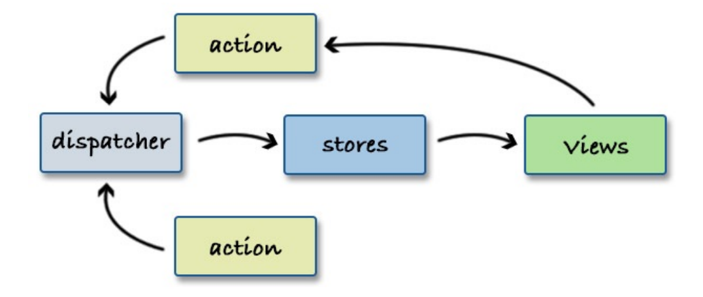

### 组合

使⽤ React children API

将 child 作为 prop 传⼊

### ⾼阶组件

⾼阶组件都是增强和组合 React 元素的最流⾏的⽅式。它们看上去与 装饰器模式 ⼗分相似，因为它是对组件的包装与增强。 从技术⻆度来说，⾼阶组件通常是函数，它接收原始组件并返回原始组件的增强/填充版本。

将函数作为 children 传⼊ 和 render prop 。当我们想要复⽤代码时，它们提供了灵活性和帮助。它们还是抽象命令式代码的强⼒⽅式。App 组件是不暴露数据结构。 

在 React 表单管理中有两个经常使⽤的术语: 受控输⼊和⾮受控输⼊。受控输⼊是指输⼊值的来源是单⼀的。

⾮受控输⼊，它让浏览器来处理⽤户的输⼊。我们还可以通过使⽤ defaultValue 属性来提供初始值，此后浏览器将负责保存输⼊的状态。ref 属性接收字符串或回调函数。

### 展示型组件和容器型组件

**容器型组件**知道数据及其结构，以及数据的来源。它们知道是如何运转的，或所谓的业务逻辑。它们接收信息并对其进⾏处理，以⽅便展示型组件使⽤。通常，我们使⽤ ⾼阶组件 来创建容器型组件，因为它们为我们的⾃定义逻辑提供了缓冲区。

**展示型组件**只涉及组件的外在展现形式。它们会有附加的 HTML 标记来使得⻚⾯更加漂亮。这种组件没有任何绑定及依赖。通常都是实现成⽆状态组件，它们没有内部状态。

将组件分成容器型组件和展示型组件可以增加组件的可复⽤性。

容器型组件封装了逻辑，它们可以搭配不同的展示型组件使⽤，因为它们不参与任何展示相关的⼯作。

### 单向数据流

单向数据流这种模式⼗分适合跟 React 搭配使⽤。它的主要思想是组件不会改变接收的数据。它们只会监听数据的变化，当数据发⽣变化时它们会使⽤接收到的新值，⽽不是去修改已有的值。当组件的更新机制触发后，它们只是使⽤新值进⾏重新渲染⽽已。

它消除了在多个地⽅同时管理状态的情况，它只会在⼀个地⽅进⾏状态管理。

### Flux 架构

这种模式的主⻆是 dispatcher 。它担当系统中所有事件的枢纽。它的⼯作就是接收我们称之为 actions (动作) 的通知并将其传给所有的 stores 。store 决定了是否对传⼊的动作感兴趣，如果感兴趣则通过改变⾃⼰的内部状态/数据来进⾏响应。改变会触发 views (视图，这⾥指 React 组件) 的重新渲染。

### ⾼阶组件

⾼阶组件模式它创建⼀个包装组件并返回原始的输⼊组件。使⽤⾼阶组件的话，就有机会来传递属性或应⽤附加逻辑。

