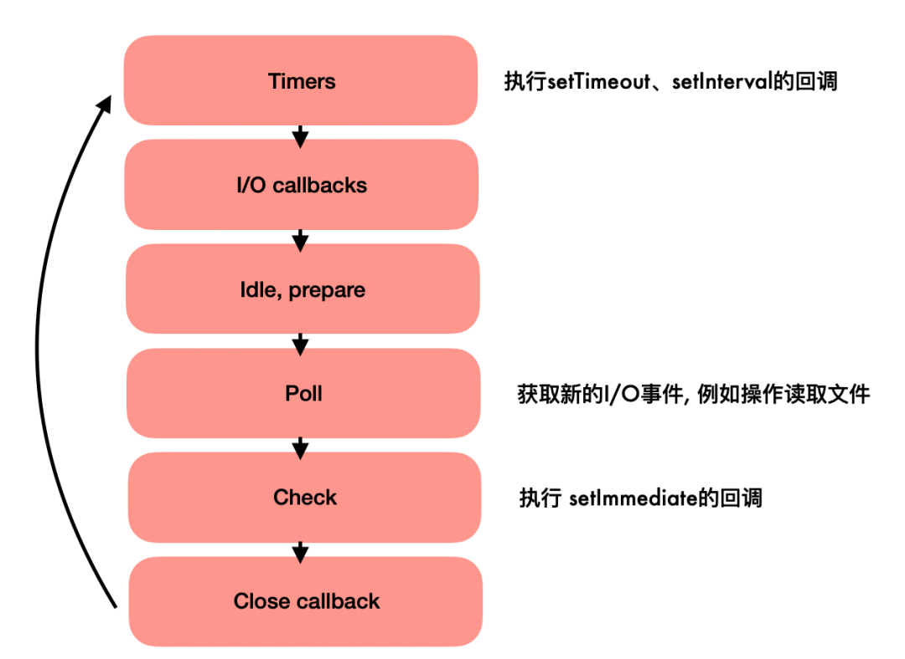

# 知识点记录

1.delete 运算符只能删除对象的属性,var, let 以及 const 创建的不可设置的属性不能被 delete 操作删除。

delete 只能删除对象自身的属性.不能删除全局作用域、或者函数作用域中，定义的变量、和参数！

2.String.prototype.substring()/substr()/slice()比较

- substring(indexStart, indexEnd) 任一参数小于 0 或为 `NaN`，则被当作 0。`indexStart` 大于 `indexEnd`，则 `substring` 的执行效果就像两个参数调换了一样
- substr(indexStart,length) indexStart 如果为负值，则被看作 `indexStart + start`
- slice(indexStart, indexEnd) indexStart, indexEnd 如果值为负数，会被当做 `strLength + beginIndex`

  3.通过修改某个属性值呈现的内容就可以被替换的元素就称为“替换元素”。

  4.设为 Flex 布局以后，**子元素的 float、clear 和 vertical-align 属性将失效**。

原型链继承，如果属性有引用类型的，改变一个，则其他的也会跟着改变

eval 将会返回对最后一个表达式的求值结果。

加号优先级高于三目运算符

将对象的方法赋值给变量后，this 指向会丢失，所以会去全局环境中找

如果是使用 Object.create(null)创建的空对象,是没有对应原型对象的!

```js
var a = 100;
function a() {
  var a = 200;
  console.log(a);
}
a(); // TypeError: a is not a function

/**
1、变量提升
var a;
a = function(){
  var a = 200;
  console.log(a);
}
a = 100;
a();

*/
```

在构造函数里面，如果不写 return 的话默认就是返回创建的实例对象。

在构造函数里面，如果写了 return 的话，

​ 1）如果 return 的是一个基本数据类型的话比如，boolean,number,undefined 等那么仍然返回实例对象；

​ 2）如果 return 的是一个对象的话，则返回该对象。原本的指向实例对象的 this 会被无效化。

**defineProperty 为对象设置属性后，该属性的描述符 writable、configurable 以及 enumberable 默认为 false。enumberable 为 false 代表该属性不可遍历**

**for ...in ...可以把原型对象身上的属性遍历出来**

**Object.keys（）不能把原型对象身上的属性遍历出来**

立即执行的函数表达式（IIFE），而且是一个具名的函数表达式（NFE）。在 ECMAScript 标准中要求 NFE 实现两个特性 1.只能在函数体内访问函数名变量。2.函数名变量可以理解为常量，不可改变。

```js
function dataURLToCanvas(dataurl, cb) {
  var canvas = document.createElement("CANVAS");
  var ctx = canvas.getContext("2d");
  var img = new Image();
  img.onload = function () {
    canvas.width = img.width;
    canvas.height = img.height;
    ctx.drawImage(img, 0, 0);
    cb(canvas);
  };
  img.src = dataurl;
}
```

问题：插件
插件包意味着首先要有个主包，比如 react-dom 依赖于 react 即使在 react-dom 中没有 require('react')。

插件的设计就是为了扩展主包功能，和主包一起使用并且是 特定版本 的主包。

如果将插件依赖的主包放到 dependencies 中就可能会出现上面那种全局一个包，插件的 node_modules 中一个包的情况。这是我们不想看到的，通常我们希望没有多余的包。

而且插件并没有实际使用主包，安装两个包的话不免有点浪费。

解决方法：Peer Dependencies
使用 peerDependencies 指定特定版本的主包，在安装依赖时 npm 会把 peerDependencies 的依赖安装程序根目录的 node_modules 。

比如，安装 react-dom 之后会看到程序根目录下有 react-dom 和 react 两个包。

├── react-dom@17.0.2
└── react@17.0.2
1
2
peerDependencies 在 npm v3 ~ npm v6 不是自动安装的，并且版本不匹配时会抛出警告。npm v7 会默认安装，并且在版本冲突时会报错。

`peer dependencies` 比较特殊，只有在发布自己的包时才会用到。或者说在为某个包开发插件的时候。

`peerDependencies`的目的是提示宿主环境去安装满足插件 peerDependencies 所指定依赖的包，然后在插件 import 或者 require 所依赖的包的时候，永远都是引用宿主环境统一安装的 npm 包，最终解决插件与所依赖包不一致的问题。

npm 7 升级之后，所有 peer dependency 会自动安装，但是如果某个包的 peer dependency 和 root 层同样包的版本冲突，npm7 会自动报错。

peerDependencies 的目的是提示宿主环境安装满足插件 peerDependencies 所指定依赖的包，然后在插件 import 或 require 所依赖的包的时候，永远都是引用宿主环境统一安装的 npm 包，解决插件与所依赖包不一致的问题。

optionalDependencies
顾名思义，optional dependencies 是可选的。即使安装失败了 npm / yarn 仍会告诉你安装成功。

该项下的依赖并不是在每台机器上都会安装，需要为不安装该项下的依赖的场景提供备选方案。

bundledDependencies
发布包时捆绑的包名列表。bundled dependencies 基本上和 dependencies 一样，也可以使用 yarn pack 来打包。

不过 dependencies 通常是从 npm 注册表安装依赖，而 bundled dependencies 在无法从 npm 注册表安装依赖的情况下非常有用：

当你想重用的第三方库不在 npm 注册表中，或者需要使用修改后的第三方库
当你想将自己的项目作为模块重用时
当你想用你的模块分发一些文件时（没有理解此场景）

setTimeout 0ms 也不是立刻执行，它有一个默认最小时间，为 4ms。

浏览器的事件循环由一个宏任务队列+多个微任务队列组成。

宏任务队列只有一个，而每一个宏任务都有一个自己的微任务队列，每轮循环都是由一个宏任务+多个微任务组成。

node 的事件循环比浏览器复杂很多。由 6 个宏任务队列+6 个微任务队列组成。



其执行规律是：在一个宏任务队列全部执行完毕后，去清空一次微任务队列，然后到下一个等级的宏任务队列，以此往复。一个宏任务队列搭配一个微任务队列。六个等级的宏任务全部执行完成，才是一轮循环。

在 node11.x 之前，微任务队列要等当前优先级的所有宏任务先执行完，在两个 setTimeout 之后才打印`微任务promise2`；在 node11.x 之后，微任务队列只用等当前这一个宏任务先执行完。

`.browserslistrc` 文件)，指定了项目的目标浏览器的范围。这个值会被 [@babel/preset-env](https://new.babeljs.io/docs/en/next/babel-preset-env.html) 和 [Autoprefixer](https://github.com/postcss/autoprefixer) 用来确定需要转译的 JavaScript 特性和需要添加的 CSS 浏览器前缀。

1. 怎么做登录

2. 怎么拿到这个页面的数据显示到下一个页面

3. 怎么获取页面元素

4. 表单验证

5. http 协议

6. 两栏布局

7. 两栏布局左边无滚动条，右边滚动条

8. 数据类型

9. 实现深拷贝

   网络的传输结构 OSI
   如何实现端对端的接口
   数据包和数据帧

   > 物理层的传输单位是数据流
   >
   > 数据链路层的传输单位是数据帧
   >
   > 网络层的传输单位是数据包
   >
   > 传输层的传输单位是数据段
   >
   > 高三层的传输单位是报文

   TCP 和 UDP 区别，属于哪层

   http 和 https 区别

   https 加密方式，什么时候用对称加密非对称加密

   ES6 新特性，

   promise

   事件循环

   实现两栏布局多种实现方式

   webpack 构建流程

重绘重排以及触发的条件
vue 生命周期
axios 拦截器怎么弄的
雪碧图怎么操作的
响应式怎么做的
display:none 和 visibility:hidden 的区别
css3 里头哪些属性能避免回流
水平垂直居中
fetch 和 ajax 和 axios 的区别
深浅拷贝
原生 js 的一些问题
从当前页面跳转到另一个页面 sessionStorage 还有没有了
url 到页面显示的过程

dns 解析的详细过程

> 比如要查询 [www.baidu.com](http://www.baidu.com/) 的 IP 地址，首先会在浏览器的缓存中查找是否有该域名的缓存，如果不存在就将请求发送到本地的 DNS 服务器中，本地 DNS 服务器会判断是否存在该域名的缓存，如果不存在，则向根域名服务器发送一个请求，根域名服务器返回负责 .com 的顶级域名服务器的 IP 地址的列表。然后本地 DNS 服务器再向其中一个负责 .com 的顶级域名服务器发送一个请求，负责 .com 的顶级域名服务器返回负责 .baidu 的权威域名服务器的 IP 地址列表。然后本地 DNS 服务器再向其中一个权威域名服务器发送一个请求，最后权威域名服务器返回一个对应的主机名的 IP 地址列表。

说说你的 vue 项目都有哪些目录，分别是什么功能

做了哪些优化

浏览器解析

webpack 及优化具体是怎么操作的

loader 和 plugin 有什么区别

分别用过哪些说一下

如果一个 js 文件压缩过后依然很大，怎么继续优化

怎么懒加载 vue 组件，图片懒加载怎么实现，怎么将其封装成一个组件 8.用到过 webpack 哪些插件，作用是什么

9.父元素高度塌陷解决，垂直方向元素外边距合并
