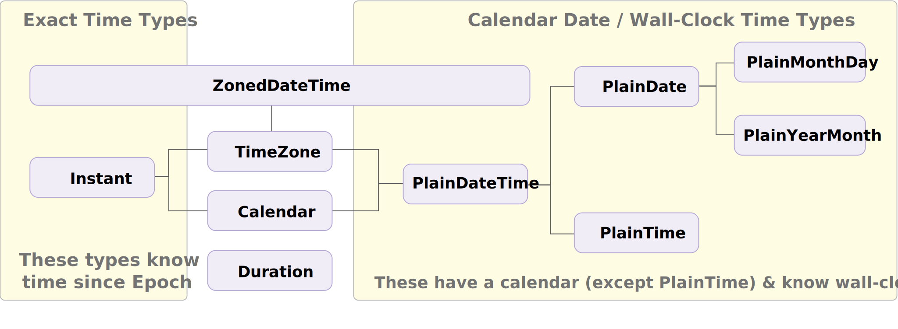
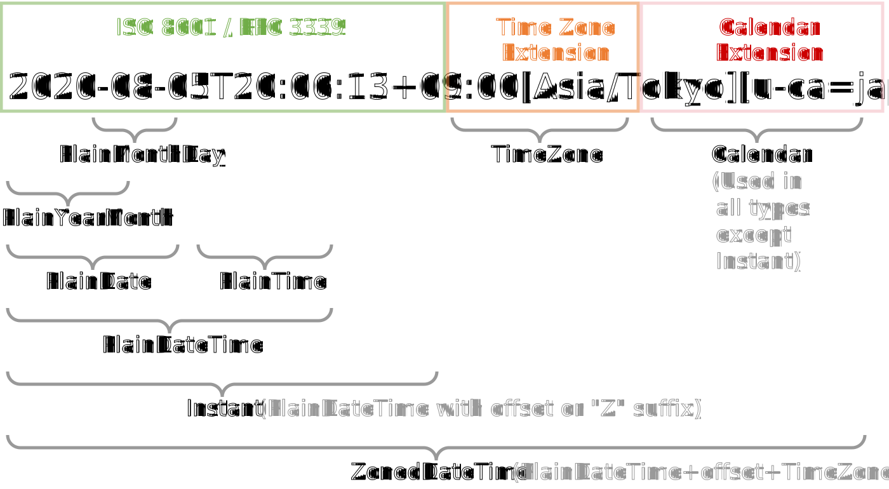

# Temporal

## `Date`问题

- 不支持用户本地时间和 UTC 以外的时区
- 解析器行为不可靠，无法使用
- Date 对象是可变的
- DST 行为不可预测（夏时制 DST (Daylight Saving Time)，或称夏令时(Summer Time)是一种为节约能源而人为规定地方时间的制度。）
- 计算 api 笨拙
- 不支持非公历

## 时间相关概念

精确时间

钟表时间

时区

夏令时

处理歧义

Unix 时间

ISO-8601

时间平衡

## 使用

```js
npm install --save proposal-temporal

const { Temporal } = require('proposal-temporal');
```

## API

Temporal 的接口遵循惯例，使用以 "Plain" 开头的类型名（`Temporal.PlainDate`，`Temporal.PlainTime`，和 `Temporal.PlainDateTime`）表示没有与之关联时区的对象。 由于时区和夏令时的关系，在这种类型和精确时间类型（`Temporal.Instant` 和 `Temporal.ZonedDateTime`）之间转换可能存在歧义，Temporal API 允许开发者来配置如何解决这种歧义。

### Temporal.Now

- `Temporal.Now.instant()` - 获取自 Unix 时间以来的精确时间
- `Temporal.Now.timeZone()` - 获取当前系统时区
- `Temporal.Now.zonedDateTime(calendar)` - 以系统时区和给定的日期格式获取当前的日期时间
- `Temporal.Now.zonedDateTimeISO()` - 以系统时区和 ISO-8601 格式获取当前的日期时间
- `Temporal.Now.plainDate(calendar)` - 以系统时区和给定的日期格式获取当前的日期
- `Temporal.Now.plainDateISO()` - 以系统时区和 ISO-8601 格式获取当前的日期
- `Temporal.Now.plainTimeISO()` - 以系统时区和 ISO-8601 格式获取当前的时间
- `Temporal.Now.plainDateTime(calendar)` - 返回当前系统时区的日期/时间，返回对象不包含时区信息，因此不应该将其用于夏令时的时间推导上。
- `Temporal.Now.plainDateTimeISO()` - 与上面相同，但是返回 ISO-8601 格式的日期时间

#### 语法：

```js

Temporal.Now.zonedDateTimeISO(timeZone: object | string = Temporal.Now.timeZone()) : Temporal.ZonedDateTime


Temporal.Now.zonedDateTime(calendar: object | string, timeZone: object | string = Temporal.Now.timeZone()) : Temporal.ZonedDateTime


Temporal.Now.instant() : Temporal.Instant


Temporal.Now.timeZone() : Temporal.TimeZone


Temporal.Now.plainDateTimeISO(timeZone: object | string = Temporal.Now.timeZone()) : Temporal.PlainDateTime


Temporal.Now.plainDateTime(calendar: object | string, timeZone: object | string = Temporal.Now.timeZone()) : Temporal.PlainDateTime


Temporal.Now.plainDateISO(timeZone: object | string = Temporal.Now.timeZone()) : Temporal.PlainDate


Temporal.Now.plainDate(calendar: object | string, timeZone: object | string = Temporal.Now.timeZone()) : Temporal.PlainDate


Temporal.Now.plainTimeISO(timeZone: object | string = Temporal.Now.timeZone()) : Temporal.PlainTime
```

**参数：**

- `timeZone` 获取当前日期和时间的时区。TimeZone 对象，一个实现时区协议的对象，或者一个字符串。如果没有给出，将使用当前系统时区。
- `calendar` 日历系统获取当前日期和时间。

### Temporal.Instant

`Temporal.Instant` 代表一个固定的时间点（称为 **"精确时间"**），不考虑历法和地点，例如：UTC 时间 1969 年 7 月 20 日 20 时 17 分。

为了获得人类可读的时间表示，可以使用 `Temporal.TimeZone` 或 `Temporal.Calendar` 与 `Temporal.ZonedDateTime` 或 `Temporal.PlainDateTime` 相结合。

### Temporal.ZonedDateTime

### Temporal.PlainDate

### Temporal.PlainTime

### Temporal.PlainDateTime

### Temporal.PlainYearMonth

### Temporal.PlainMonthDay

### Temporal.Duration

### Temporal.TimeZone

### Temporal.Calendar

## 对象关系



## 字符串持久化

为了持久性和互操作性，所有的 `Temporal` 类型都有一个字符串表示。类型和字符串之间的对应关系如下所示。



## Date & Temporal

## 参考

https://maggiepint.com/2017/04/09/fixing-javascript-date-getting-started/

https://tc39.es/proposal-temporal/docs/balancing.html

https://tc39.es/proposal-temporal/docs/zh_CN/index.html

https://github.com/tc39/proposal-temporal

https://tc39.es/proposal-temporal/docs/cookbook.html

https://tc39.es/proposal-temporal/docs/ambiguity.html

https://tc39.es/proposal-temporal/docs/balancing.html
