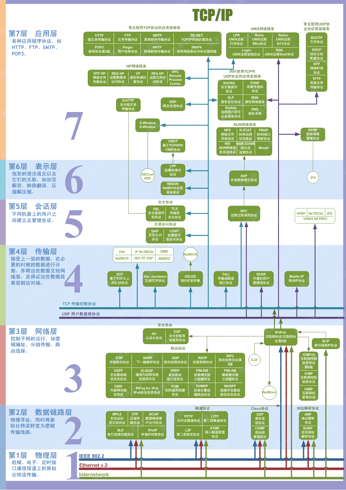

# 计算机网络

## OSI 模型和 TCP/IP

## TCP 和 UDP

### TCP

#### TCP 特点

-   面向连接的传输层协议
-   只支持点对点连接（一对一）
-   提供可靠交付服务
-   提供全双工通信
-   面向字节流

### 三次握手

最开始的时候客户端和服务器都是处于 CLOSED 状态。主动打开连接的为客户端，被动打开连接的是服务器。

#### 三次握手过程

1、TCP 服务器进程先创建传输控制块 TCB，时刻准备接受客户进程的连接请求，此时服务器就进入了 **LISTEN（监听）状态**；

2、TCP 客户进程也是先创建传输控制块 TCB，然后向服务器发出连接请求报文，这是报文首部中的同部位 SYN=1，同时选择一个初始序列号 seq=x ，此时，TCP 客户端进程进入了 **SYN-SENT（同步已发送状态）状态**。TCP 规定，SYN 报文段（SYN=1 的报文段）不能携带数据，但需要消耗掉一个序号。

3、TCP 服务器收到请求报文后，如果同意连接，则发出确认报文。确认报文中应该 ACK=1，SYN=1，确认号是 ack=x+1，同时也要为自己初始化一个序列号 seq=y，此时，TCP 服务器进程进入了 **SYN-RCVD（同步收到）状态**。这个报文也不能携带数据，但是同样要消耗一个序号。

4、TCP 客户进程收到确认后，还要向服务器给出确认。确认报文的 ACK=1，ack=y+1，自己的序列号 seq=x+1，此时，TCP 连接建立，客户端进入 **ESTABLISHED（已建立连接）状态**。TCP 规定，ACK 报文段可以携带数据，但是如果不携带数据则不消耗序号。

5、当服务器收到客户端的确认后也进入 **ESTABLISHED 状态**，此后双方就可以开始通信了。

#### 为什么 TCP 客户端最后还要发送一次确认呢？

一句话，主要防止已经失效的连接请求报文突然又传送到了服务器，从而产生错误。

如果使用的是两次握手建立连接，假设有这样一种场景，客户端发送了第一个请求连接并且没有丢失，只是因为在网络结点中滞留的时间太长了，由于 TCP 的客户端迟迟没有收到确认报文，以为服务器没有收到，此时重新向服务器发送这条报文，此后客户端和服务器经过两次握手完成连接，传输数据，然后关闭连接。此时此前滞留的那一次请求连接，网络通畅了到达了服务器，这个报文本该是失效的，但是，两次握手的机制将会让客户端和服务器再次建立连接，这将导致不必要的错误和资源的浪费。

如果采用的是三次握手，就算是那一次失效的报文传送过来了，服务端接受到了那条失效报文并且回复了确认报文，但是客户端不会再次发出确认。由于服务器收不到确认，就知道客户端并没有请求连接。

### 四次挥手

数据传输完毕后，双方都可释放连接。最开始的时候，客户端和服务器都是处于 ESTABLISHED 状态，然后客户端主动关闭，服务器被动关闭。

#### 四次挥手过程

1、客户端进程发出连接释放报文，并且停止发送数据。释放数据报文首部，FIN=1，其序列号为 seq=u（等于前面已经传送过来的数据的最后一个字节的序号加 1），此时，客户端进入 FIN-WAIT-1（终止等待 1）状态。 TCP 规定，FIN 报文段即使不携带数据，也要消耗一个序号。

2、服务器收到连接释放报文，发出确认报文，ACK=1，ack=u+1，并且带上自己的序列号 seq=v，此时，服务端就进入了 CLOSE-WAIT（关闭等待）状态。TCP 服务器通知高层的应用进程，客户端向服务器的方向就释放了，这时候处于半关闭状态，即客户端已经没有数据要发送了，但是服务器若发送数据，客户端依然要接受。这个状态还要持续一段时间，也就是整个 CLOSE-WAIT 状态持续的时间。

3、客户端收到服务器的确认请求后，此时，客户端就进入 FIN-WAIT-2（终止等待 2）状态，等待服务器发送连接释放报文（在这之前还需要接受服务器发送的最后的数据）。

4、服务器将最后的数据发送完毕后，就向客户端发送连接释放报文，FIN=1，ack=u+1，由于在半关闭状态，服务器很可能又发送了一些数据，假定此时的序列号为 seq=w，此时，服务器就进入了 **LAST-ACK（最后确认）状态**，等待客户端的确认。

5、客户端收到服务器的连接释放报文后，必须发出确认，ACK=1，ack=w+1，而自己的序列号是 seq=u+1，此时，客户端就进入了 TIME-WAIT（时间等待）状态。注意此时 TCP 连接还没有释放，必须经过 2\*MSL（最长报文段寿命）的时间后，当客户端撤销相应的 TCB 后，才进入 CLOSED 状态。

6、服务器只要收到了客户端发出的确认，立即进入 CLOSED 状态。同样，撤销 TCB 后，就结束了这次的 TCP 连接。可以看到，服务器结束 TCP 连接的时间要比客户端早一些。

#### 为什么客户端最后还要等待 2MSL？

MSL（Maximum Segment Lifetime），TCP 允许不同的实现可以设置不同的 MSL 值。

第一，保证客户端发送的最后一个 ACK 报文能够到达服务器，因为这个 ACK 报文可能丢失，站在服务器的角度看来，我已经发送了 FIN+ACK 报文请求断开了，客户端还没有给我回应，应该是我发送的请求断开报文它没有收到，于是服务器又会重新发送一次，而客户端就能在这个 2MSL 时间段内收到这个重传的报文，接着给出回应报文，并且会重启 2MSL 计时器。

第二，防止类似与“三次握手”中提到了的“已经失效的连接请求报文段”出现在本连接中。客户端发送完最后一个确认报文后，在这个 2MSL 时间中，就可以使本连接持续的时间内所产生的所有报文段都从网络中消失。这样新的连接中不会出现旧连接的请求报文。

#### 为什么建立连接是三次握手，关闭连接确是四次挥手呢？

建立连接的时候， 服务器在 LISTEN 状态下，收到建立连接请求的 SYN 报文后，把 ACK 和 SYN 放在一个报文里发送给客户端。

而关闭连接时，服务器收到对方的 FIN 报文时，仅仅表示对方不再发送数据了但是还能接收数据，而自己也未必全部数据都发送给对方了，所以己方可以立即关闭，也可以发送一些数据给对方后，再发送 FIN 报文给对方来表示同意现在关闭连接，因此，己方 ACK 和 FIN 一般都会分开发送，从而导致多了一次。

#### 如果已经建立了连接，但是客户端突然出现故障了怎么办？

TCP 还设有一个保活计时器，显然，客户端如果出现故障，服务器不能一直等下去，白白浪费资源。服务器每收到一次客户端的请求后都会重新复位这个计时器，时间通常是设置为 2 小时，若两小时还没有收到客户端的任何数据，服务器就会发送一个探测报文段，以后每隔 75 秒发送一次。若一连发送 10 个探测报文仍然没反应，服务器就认为客户端出了故障，接着就关闭连接。

### UDP

#### UDP 特点

-   无连接
-   面向报文
-   尽最大努力交付
-   无拥塞控制
-   支持一对一、一对多、多对一、多对多通信
-   首部只有 8 个字节

## HTTP 协议

超文本传输协议（HTTP，HyperText Transfer Protocol) 主要是为 Web 浏览器与 Web 服务器之间的通信而设计的。

HTTP 协是基于 TCP 协议，发送 HTTP 请求之前首先要建立 TCP 连接也就是要经历 3 次握手。目前使用的 HTTP 协议大部分都是 1.1。在 1.1 的协议里面，默认是开启了 Keep-Alive 的，这样的话建立的连接就可以在多次请求中被复用了。

另外， HTTP 协议是”无状态”的协议，它无法记录客户端用户的状态，一般我们都是通过 Session 来记录客户端用户的状态。

## HTTPS 协议

## DNS
